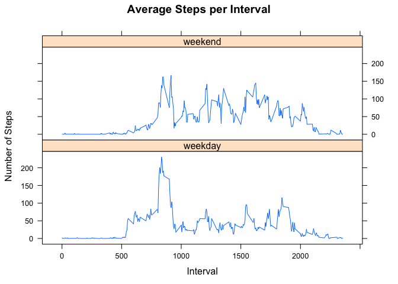

# Reproducible Research: Peer Assessment 1

## Loading required packages
We need the following libraries:

- dplyr: for transforming data
- lattice: for plotting
- ggplot2: for plotting
- knitr: for weaving RMarkdown to HTML


```r
require(dplyr)
```

```
## Loading required package: dplyr
## 
## Attaching package: 'dplyr'
## 
## The following object is masked from 'package:stats':
## 
##     filter
## 
## The following objects are masked from 'package:base':
## 
##     intersect, setdiff, setequal, union
```

```r
require(lattice)
```

```
## Loading required package: lattice
```

```
## Warning: package 'lattice' was built under R version 3.1.3
```

```r
require(ggplot2)
```

```
## Loading required package: ggplot2
```

```
## Warning: package 'ggplot2' was built under R version 3.1.3
```

```r
require(knitr)
```

```
## Loading required package: knitr
```

```
## Warning: package 'knitr' was built under R version 3.1.3
```


## Loading and preprocessing the data

Unzip and load the raw data.


```r
unzip("activity.zip")
rawData <- read.csv("activity.csv")
```


## What is mean total number of steps taken per day?

Aggregate total number of steps by date.


```r
totalStepsPerDay <- aggregate(x = rawData$steps, 
							  by = list(date = rawData$date), 
							  FUN = sum)

names(totalStepsPerDay) = c("date", "totalSteps")
```

Calculate mean number of steps per day.


```r
meanSteps <- mean(totalStepsPerDay$totalSteps, na.rm = TRUE)
meanSteps
```

```
## [1] 10766.19
```

Calculate median number of steps per day.


```r
medianSteps <- median(totalStepsPerDay$totalSteps, na.rm = TRUE)
medianSteps
```

```
## [1] 10765
```

Plot the histogram of total number of steps per day.


```r
qplot(totalSteps, data = totalStepsPerDay, binwidth = 2500, 
	  xlab = "Number of Steps", main = "Histogram of Total Steps per Day")
```

 


## What is the average daily activity pattern?

Aggregate average number of steps by interval.


```r
avgStepsPerInt <- aggregate(x = rawData$steps, 
							by = list(interval = rawData$interval), 
							FUN = mean, na.rm = TRUE)

names(avgStepsPerInt) <- c("interval", "avgSteps")
```

Plot the average number of steps per interval.


```r
xyplot(avgSteps ~ interval, data = avgStepsPerInt, type = "l", 
	   xlab = "Interval", ylab = "Number of Steps", main = "Average Steps per Interval")
```

 

The interval with the highest average number of steps is 8:35 - 8:40 am.


```r
maxInterval <- avgStepsPerInt[avgStepsPerInt$avgSteps == max(avgStepsPerInt$avgSteps), 1]
```


## Imputing missing values

Calculate the number of missing values.


```r
numNA <- sum(is.na(rawData$steps))
```

I replace any missing value with the average number of steps of that interval.


```r
newData <- merge(rawData, avgStepsPerInt)

newData <- mutate(newData, steps = ifelse(is.na(steps), avgSteps, steps))
```

With missing values filled in, aggregate total number of steps again by date.


```r
newTotalStepsPerDay <- aggregate(x = newData$steps, 
								 by = list(date = newData$date), 
								 FUN = sum)

names(newTotalStepsPerDay) = c("date", "totalSteps")
```

Plot the histogram of total number steps per day, this time with missing values filled in.


```r
qplot(totalSteps, data = newTotalStepsPerDay, binwidth = 2500,
	  xlab = "Number of Steps", main = "Histogram of Total Steps per Day")
```

 

Calculate mean and median number of steps per day.


```r
newMeanSteps <- mean(newTotalStepsPerDay$totalSteps, na.rm = TRUE)
newMedianSteps <- median(newTotalStepsPerDay$totalSteps, na.rm = TRUE)
```

Make a comparison table of mean and median number of steps before/after imputing missing values.


```r
comp <- matrix(c(meanSteps, medianSteps, newMeanSteps, newMedianSteps), ncol = 2)
colnames(comp) <- c('Original', 'New')
rownames(comp) <- c('Mean', 'Median')
comp.table <- as.table(comp)
```

There's no change in mean and a small change in median.


```r
comp.table
```

```
##        Original      New
## Mean   10766.19 10766.19
## Median 10765.00 10766.19
```


## Are there differences in activity patterns between weekdays and weekends?

Change the system locale because I need the days of week to be in English, i.e. Monday, Tuesday, ...


```r
locale <- Sys.getlocale('LC_TIME')
Sys.setlocale('LC_TIME', 'C')
```

```
## [1] "C"
```

Distinguish between weekdays and weekend.


```r
newData <- mutate(newData, weekday = 
				  	ifelse(weekdays(as.Date(date)) %in% c("Sunday", "Saturday"), FALSE, TRUE))

weekdayData <- newData[newData$weekday, ]
weekendData <- newData[!newData$weekday, ]
```

Aggregate average number of steps per interval for weekdays and weenend, respectively. Then combine them together.


```r
weekdayAvgSteps <- aggregate(x = weekdayData$steps, 
							 by = list(interval = weekdayData$interval), 
							 FUN = mean, na.rm = TRUE)

weekendAvgSteps <- aggregate(x = weekendData$steps, 
							 by = list(interval = weekendData$interval), 
							 FUN = mean, na.rm = TRUE)

weekdayAvgSteps$weekday = "weekday"
weekendAvgSteps$weekday = "weekend"

newAvgStepsPerInt <- rbind(weekdayAvgSteps, weekendAvgSteps)

names(newAvgStepsPerInt) = c("interval", "avgSteps", "weekday")
```

Plot the average number of steps per interval for weekdays and weekend, respectively, and put the plots side by side for comparison.  

It appears that the individual took more steps over the weekend than on weekdays. Moreover, on weekdays, there was a clear peak in the morning.


```r
xyplot(avgSteps ~ interval | weekday, data = newAvgStepsPerInt, type = "l", layout = c(1, 2),
	   xlab = "Interval", ylab = "Number of Steps", main = "Average Steps per Interval")
```

 

Remember to revert the system locale.


```r
Sys.setlocale('LC_TIME', locale)
```

```
## [1] "zh_TW.UTF-8"
```

